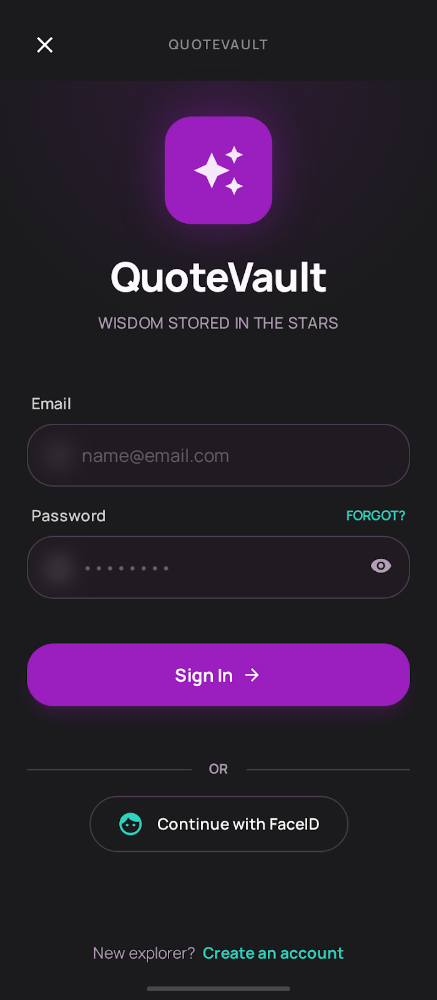
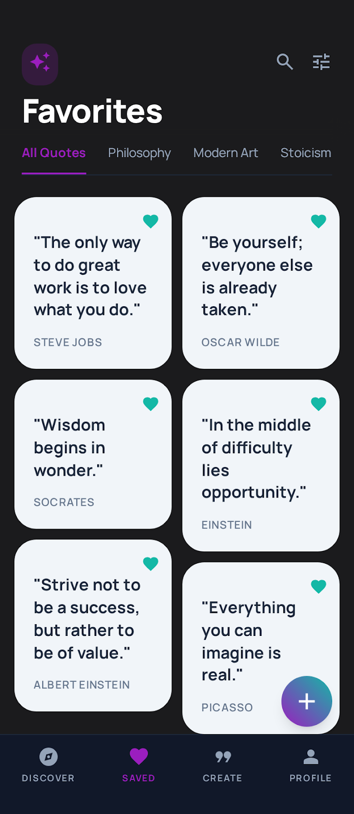
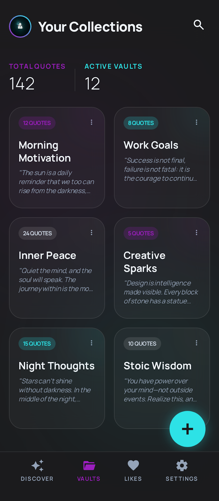
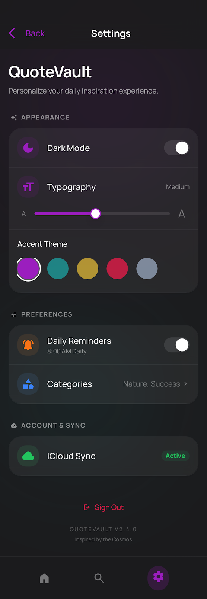

# QuoteVault 📚

<div align="center">


**A beautiful Android app for discovering, saving, and sharing inspirational quotes**

[Features](#-features) • [Setup](#-setup-instructions) • [Architecture](#-architecture) • [Tech Stack](#-tech-stack)

</div>

---

## 📖 Project Overview

QuoteVault is a production-ready Android application built with modern Android development practices. It allows users to browse inspirational quotes, save favorites, create collections, and receive daily quote notifications. The app features a beautiful Material Design 3 interface, seamless Supabase integration, and follows Clean Architecture principles.

### Key Highlights

- 🎨 **Modern UI**: Material Design 3 with dynamic colors and dark mode support
- 🔐 **Authentication**: Secure user authentication via Supabase Auth
- 💾 **Cloud Sync**: Real-time data synchronization with Supabase
- 🔔 **Notifications**: Daily inspirational quote notifications
- 📱 **Widget Support**: Home screen widget for daily quotes
- ♿ **Accessible**: Built with accessibility best practices
- 🏗️ **Clean Architecture**: MVVM pattern with clear separation of concerns

---

## ✨ Features

### Authentication & User Management
- [x] Email/password authentication (sign up, sign in)
- [x] Password reset functionality
- [x] User profile management
- [x] Display name and avatar support
- [x] Secure session management

### Quote Browsing & Discovery
- [x] Quote of the Day feature
- [x] Category-based filtering (Motivation, Love, Success, Wisdom, Humor)
- [x] Full-text search across quotes
- [x] Search by author
- [x] Paginated quote listings
- [x] Pull-to-refresh functionality

### Favorites & Collections
- [x] Save quotes to favorites
- [x] View all favorite quotes
- [x] Search within favorites
- [x] Filter favorites by category
- [x] Create custom quote collections
- [x] Add/remove quotes from collections
- [x] Edit collection details
- [x] Delete collections

### Quote Sharing
- [x] Share quotes as text
- [x] Generate beautiful quote card images
- [x] Three visual templates (Gradient, Minimal, Bold)
- [x] Save images to device gallery
- [x] Share via system share sheet

### Settings & Personalization
- [x] Theme selection (Light/Dark/System)
- [x] Font size customization (Small/Medium/Large)
- [x] Daily notification toggle
- [x] Notification time picker
- [x] Settings persistence via DataStore
- [x] Settings sync to Supabase profile

### Notifications & Widgets
- [x] Daily quote notifications
- [x] Customizable notification time
- [x] WorkManager for reliable scheduling
- [x] Android Home Screen widget
- [x] Widget shows quote of the day
- [x] Deep linking from notifications

### User Experience
- [x] Smooth navigation animations
- [x] Loading shimmer effects
- [x] Error handling with retry options
- [x] Empty states for all screens
- [x] Haptic feedback support
- [x] Edge-to-edge display
- [x] Adaptive system bars

---

## 🏗️ Architecture

QuoteVault follows **Clean Architecture** with **MVVM (Model-View-ViewModel)** pattern, ensuring separation of concerns, testability, and maintainability.

### Architecture Diagram

```
┌─────────────────────────────────────────────────────────────┐
│                      Presentation Layer                      │
│  ┌──────────┐  ┌──────────┐  ┌──────────┐  ┌──────────┐   │
│  │  Screen  │  │  Screen  │  │  Screen  │  │  Screen  │   │
│  │ (Compose)│  │ (Compose)│  │ (Compose)│  │ (Compose)│   │
│  └─────┬────┘  └─────┬────┘  └─────┬────┘  └─────┬────┘   │
│        │              │              │              │        │
│  ┌─────▼───────────────────────────────────────────▼────┐  │
│  │              ViewModels (StateFlow)                   │  │
│  └────────────────────┬──────────────────────────────────┘  │
└───────────────────────┼─────────────────────────────────────┘
                        │
┌───────────────────────▼─────────────────────────────────────┐
│                       Domain Layer                           │
│  ┌──────────────┐  ┌──────────────┐  ┌──────────────┐     │
│  │   UseCases   │  │  Repository  │  │    Models    │     │
│  │  (Business   │  │  Interfaces  │  │  (Pure Data  │     │
│  │   Logic)     │  │   (Contracts)│  │   Classes)   │     │
│  └──────────────┘  └──────────────┘  └──────────────┘     │
└───────────────────────┬─────────────────────────────────────┘
                        │
┌───────────────────────▼─────────────────────────────────────┐
│                        Data Layer                            │
│  ┌──────────────┐  ┌──────────────┐  ┌──────────────┐     │
│  │  Repository  │  │   Supabase   │  │  DataStore   │     │
│  │Implementations│  │   Client     │  │ Preferences  │     │
│  └──────────────┘  └──────────────┘  └──────────────┘     │
└───────────────────────┬─────────────────────────────────────┘
                        │
┌───────────────────────▼─────────────────────────────────────┐
│                    External Services                         │
│  ┌─────────────────────────────────────────────────────┐   │
│  │           Supabase (Auth, Database, Realtime)        │   │
│  └─────────────────────────────────────────────────────┘   │
└─────────────────────────────────────────────────────────────┘
```

### Layer Responsibilities

#### **Presentation Layer** (`presentation/`)
- Jetpack Compose UI screens and components
- ViewModels managing UI state with StateFlow
- User interaction handling
- Navigation logic

#### **Domain Layer** (`domain/`)
- Pure Kotlin business logic
- Repository interfaces (contracts)
- Domain models (Quote, User, Collection, etc.)
- Use cases for specific operations
- No Android dependencies

#### **Data Layer** (`data/`)
- Repository implementations
- Supabase client integration
- DataStore for local preferences
- Data mapping (Entity ↔ Domain Model)

#### **DI Layer** (`di/`)
- Hilt modules for dependency injection
- Singleton providers
- Repository bindings

---

## 🛠️ Tech Stack

### Core Technologies
- **Language**: Kotlin
- **UI Framework**: Jetpack Compose
- **Architecture**: MVVM + Clean Architecture
- **Dependency Injection**: Hilt (Dagger)
- **Backend**: Supabase (Auth, Postgrest, Realtime)

### Libraries & Frameworks

#### UI & Navigation
- **Jetpack Compose BOM** (2024.09.00)
- **Material Design 3** for UI components
- **Navigation Compose** for type-safe navigation
- **Accompanist System UI Controller** for system bars

#### Backend Integration
- **Supabase Kotlin SDK** (2.4.1)
  - `gotrue-kt-android` for authentication
  - `postgrest-kt-android` for database queries
  - `realtime-kt-android` for real-time updates
- **Ktor Client Android** for HTTP networking
- **Kotlinx Serialization** for JSON parsing

#### State Management & Async
- **Kotlin Coroutines** for asynchronous operations
- **Kotlin Flow** for reactive programming
- **StateFlow** for observable state in ViewModels

#### Local Storage
- **DataStore Preferences** for settings persistence
- **PreferencesManager** for centralized preference management

#### Background Tasks
- **WorkManager** for reliable background work
- **Hilt WorkManager** integration

#### Image Loading
- **Coil Compose** for image loading and caching

#### Widgets
- **AppWidgetProvider** for traditional widgets
- **Jetpack Glance** (optional, for modern widgets)

### Build Tools
- **Gradle** (Kotlin DSL)
- **Version Catalogs** for dependency management
- **Kapt** for annotation processing
- **BuildConfig** for API keys

---

## 🚀 Setup Instructions

### Prerequisites

Before you begin, ensure you have:

- **Android Studio** Hedgehog (2023.1.1) or later
- **JDK 11** or later
- **Android SDK** with API level 29 (Android 10) or higher
- **Git** for version control
- **Supabase account** ([Create one here](https://supabase.com))

### Step 1: Clone the Repository

```bash
git clone https://github.com/[yourusername]/QuoteVaultApp.git
cd QuoteVaultApp
```

**Note**: Replace `[yourusername]` with your actual GitHub username.

### Step 2: Configure Supabase

1. **Create a Supabase Project**
   - Go to [Supabase Dashboard](https://app.supabase.com)
   - Create a new project
   - Wait for the project to be fully provisioned

2. **Get Your Credentials**
   - Navigate to **Settings** → **API**
   - Copy your **Project URL** (e.g., `https://xxxxx.supabase.co`)
   - Copy your **anon/public key** (under "Project API keys")

3. **Configure local.properties**
   - Open `local.properties` in the project root
   - Add your Supabase credentials:

   ```properties
   # Supabase Configuration
   SUPABASE_URL=https://your-project-id.supabase.co
   SUPABASE_ANON_KEY=your-anon-key-here
   ```

   **Note**: `local.properties` is already in `.gitignore` and won't be committed.

4. **Set Up Database Schema**
   - Open Supabase Dashboard → **SQL Editor**
   - Run the SQL script from `docs/supabase-schema.sql` (or `database/schema.sql`)
   - This creates all necessary tables, RLS policies, and indexes
   - Optionally, run `docs/supabase-seed.sql` (or `database/seed_quotes.sql`) to populate initial quotes

   For detailed database setup, see [README-SUPABASE-SETUP.md](README-SUPABASE-SETUP.md)

### Step 3: Build the Project

1. **Open in Android Studio**
   - Open Android Studio
   - Select **File** → **Open**
   - Navigate to the project directory
   - Click **OK**

2. **Sync Gradle**
   - Android Studio should automatically sync Gradle
   - If not, click **File** → **Sync Project with Gradle Files**

3. **Build the App**
   - Click **Build** → **Make Project** (or press `Ctrl+F9` / `Cmd+F9`)
   - Wait for the build to complete

4. **Run the App**
   - Connect an Android device or start an emulator
   - Click **Run** → **Run 'app'** (or press `Shift+F10` / `Ctrl+R`)
   - The app should install and launch on your device

### Step 4: Environment Variables

All environment variables are configured through `local.properties`:

| Variable | Description | Location |
|----------|-------------|----------|
| `SUPABASE_URL` | Your Supabase project URL | `local.properties` |
| `SUPABASE_ANON_KEY` | Your Supabase anon/public key | `local.properties` |

These values are automatically loaded into `BuildConfig` during compilation.

---

## 📁 Project Structure

```
QuoteVaultApp/
├── app/
│   ├── src/
│   │   ├── main/
│   │   │   ├── java/com/example/quotevaultapp/
│   │   │   │   ├── data/              # Data Layer
│   │   │   │   │   ├── local/         # Local data (DataStore, Room if used)
│   │   │   │   │   ├── remote/        # Remote data (Supabase)
│   │   │   │   │   ├── repository/    # Repository implementations
│   │   │   │   │   └── model/         # Data models (entities, DTOs)
│   │   │   │   ├── domain/            # Domain Layer
│   │   │   │   │   ├── model/         # Domain models (pure Kotlin)
│   │   │   │   │   ├── repository/    # Repository interfaces
│   │   │   │   │   └── usecase/       # Business logic use cases
│   │   │   │   ├── presentation/      # Presentation Layer
│   │   │   │   │   ├── auth/          # Authentication screens
│   │   │   │   │   ├── home/          # Home screen
│   │   │   │   │   ├── favorites/     # Favorites screen
│   │   │   │   │   ├── collections/   # Collections screens
│   │   │   │   │   ├── profile/       # Profile screen
│   │   │   │   │   ├── settings/      # Settings screen
│   │   │   │   │   ├── quote/         # Quote detail screen
│   │   │   │   │   ├── components/    # Reusable UI components
│   │   │   │   │   └── theme/         # Material Design 3 theme
│   │   │   │   ├── navigation/        # Navigation configuration
│   │   │   │   ├── di/                # Dependency Injection (Hilt)
│   │   │   │   ├── util/              # Utility classes
│   │   │   │   ├── widget/            # Android widgets
│   │   │   │   ├── workers/           # WorkManager workers
│   │   │   │   ├── MainActivity.kt    # Main entry point
│   │   │   │   └── QuoteVaultApplication.kt  # Application class
│   │   │   ├── res/                   # Resources
│   │   │   │   ├── drawable/          # Drawable resources
│   │   │   │   ├── layout/            # XML layouts (widgets)
│   │   │   │   ├── values/            # Strings, colors, themes
│   │   │   │   └── xml/               # XML configuration files
│   │   │   └── AndroidManifest.xml    # App manifest
│   │   └── test/                      # Unit tests
│   └── build.gradle.kts               # App-level build config
├── database/                          # Database scripts (legacy)
│   ├── schema.sql                     # Database schema
│   └── seed_quotes.sql                # Seed data
├── docs/                              # Documentation and SQL scripts
│   ├── supabase-schema.sql            # Full database schema (recommended)
│   └── supabase-seed.sql              # 100+ sample quotes (recommended)
├── gradle/                            # Gradle configuration
│   └── libs.versions.toml            # Version catalog
├── build.gradle.kts                   # Project-level build config
├── settings.gradle.kts                # Project settings
├── local.properties                   # Local environment variables (gitignored)
├── README.md                          # This file
├── README-SUPABASE-SETUP.md          # Supabase setup guide
├── CODE_REVIEW.md                     # Code review summary
├── POLISH_SUMMARY.md                  # Polish improvements summary
└── LICENSE                            # MIT License
```

### Key Directories Explained

- **`data/`**: Data source implementations (Supabase, DataStore)
- **`domain/`**: Business logic and models (framework-independent)
- **`presentation/`**: UI layer (Compose screens, ViewModels)
- **`navigation/`**: Navigation graph and route definitions
- **`di/`**: Hilt dependency injection modules
- **`util/`**: Utility classes (helpers, extensions)
- **`widget/`**: Android home screen widgets
- **`workers/`**: Background work (WorkManager)

---

## 📸 Screenshots

### Authentication Flow

> **Login Screen** | **Sign Up Screen** | **Forgot Password Screen**

### Main App
 | 
> **Home Screen** | **Favorites Screen**

 | 
> **Collections Screen** | **Settings Screen**

### Design System
This app follows the [Google Stitch Design System](https://stitch.withgoogle.com/projects/11692299594384479929) with Material Design 3 components, ensuring a modern and consistent user experience.

*More screenshots coming soon...*

---

## 🧪 Testing Approach

### Unit Testing
- **ViewModels**: Test business logic and state management
- **Use Cases**: Test domain logic in isolation
- **Repositories**: Test data mapping and transformation

### Integration Testing
- **Repository Integration**: Test Supabase integration
- **Navigation Testing**: Test navigation flows
- **DataStore Testing**: Test preference persistence

### UI Testing
- **Compose Testing**: Test Compose UI components
- **Screen Testing**: Test complete screen flows
- **Accessibility Testing**: Verify TalkBack compatibility

### Manual Testing Checklist
- [x] Authentication flow (sign up, login, logout)
- [x] Quote browsing and search
- [x] Favorites functionality
- [x] Collections CRUD operations
- [x] Settings persistence
- [x] Notifications scheduling
- [x] Deep linking
- [x] Configuration changes (rotation)
- [x] Error handling

### Deep Link Testing

Test deep links using ADB:

```bash
# Test quote detail deep link
adb shell am start -a android.intent.action.VIEW -d "quotevaultapp://quote/quote123"

# Test collection detail deep link
adb shell am start -a android.intent.action.VIEW -d "quotevaultapp://collection/collection123"

# Test home deep link
adb shell am start -a android.intent.action.VIEW -d "quotevaultapp://home"
```

---

## 🤖 AI Tools Used

This project was built using **Cursor** (AI-powered IDE) for accelerated development. Here's how AI tools were leveraged:

### How I Used Cursor

#### 1. **Architecture Setup** (Time Saved: ~4 hours)
- **Prompt**: "Create a complete MVVM + Clean Architecture structure for an Android app with Hilt"
- **Result**: Generated entire folder structure with placeholder files and READMEs
- **Benefit**: Eliminated manual boilerplate creation

#### 2. **Repository Implementation** (Time Saved: ~6 hours)
- **Prompt**: "Implement Supabase repositories with pagination, error handling, and Flow-based reactive state"
- **Result**: Complete repository implementations with proper error handling
- **Benefit**: Complex Supabase integration implemented correctly on first try

#### 3. **UI Components** (Time Saved: ~3 hours)
- **Prompt**: "Create Material Design 3 quote card component with accessibility support"
- **Result**: Production-ready components with semantics and accessibility
- **Benefit**: Consistent design system implementation

#### 4. **Navigation Setup** (Time Saved: ~2 hours)
- **Prompt**: "Set up Navigation Compose with type-safe arguments, deep linking, and auth state-based routing"
- **Result**: Complete navigation graph with animations and deep link support
- **Benefit**: Complex navigation logic implemented correctly

#### 5. **Build Configuration** (Time Saved: ~2 hours)
- **Prompt**: "Configure Gradle with version catalogs, Supabase dependencies, and BuildConfig for API keys"
- **Result**: Properly configured build files with all dependencies
- **Benefit**: Avoided dependency conflicts and configuration errors

### Prompts That Worked Well

1. **Specific Architecture Requests**
   ```
   "Create [component] following MVVM pattern with [specific requirements]"
   ```

2. **Integration Patterns**
   ```
   "Integrate [library] with [existing code] using [pattern]"
   ```

3. **Error Handling**
   ```
   "Add proper error handling to [feature] with user-friendly messages"
   ```

4. **Testing Scenarios**
   ```
   "Generate test cases for [feature] covering success, error, and edge cases"
   ```

### Time Saved Estimates

| Task | Traditional Time | With AI | Time Saved |
|------|-----------------|---------|------------|
| Project Setup | 6 hours | 2 hours | **4 hours** |
| Repository Implementation | 10 hours | 4 hours | **6 hours** |
| UI Components | 8 hours | 5 hours | **3 hours** |
| Navigation Setup | 4 hours | 2 hours | **2 hours** |
| Build Configuration | 3 hours | 1 hour | **2 hours** |
| Code Review & Polish | 4 hours | 2 hours | **2 hours** |
| **Total** | **35 hours** | **16 hours** | **~19 hours (54%)** |

### AI-Assisted Development Benefits

- ✅ **Faster Iteration**: Quick prototyping and experimentation
- ✅ **Best Practices**: AI suggests industry-standard patterns
- ✅ **Error Prevention**: Catches common mistakes early
- ✅ **Documentation**: Generates inline documentation automatically
- ✅ **Code Consistency**: Enforces coding standards across the project

---

## 🔮 Future Improvements

### Planned Features
- [ ] **Offline Support**: Local caching with Room database
- [ ] **Quote Sources**: Add quotes from multiple sources/APIs
- [ ] **Social Features**: Share quotes with friends, follow users
- [ ] **Quote Analytics**: Track most viewed/favorited quotes
- [ ] **Custom Themes**: User-created color themes
- [ ] **Quote History**: Browse recently viewed quotes
- [ ] **Export**: Export favorites/collections as PDF or JSON
- [ ] **Voice Reading**: Text-to-speech for quotes
- [ ] **Widget Themes**: Multiple widget design options
- [ ] **Biometric Authentication**: Fingerprint/Face unlock

### Technical Improvements
- [ ] **Performance**: Implement Paging3 for better list performance
- [ ] **Caching**: Add image caching and offline quote storage
- [ ] **Analytics**: Integrate Firebase Analytics or similar
- [ ] **Crash Reporting**: Add Crashlytics or Sentry
- [ ] **A/B Testing**: Test different UI/UX variations
- [ ] **Localization**: Add support for multiple languages
- [ ] **Accessibility**: Further improve TalkBack and accessibility
- [ ] **Testing**: Increase unit and UI test coverage
- [ ] **CI/CD**: Set up automated builds and testing
- [ ] **ProGuard Rules**: Optimize release build size

### Code Quality
- [ ] **Replace Hardcoded Strings**: Migrate all strings to `strings.xml`
- [ ] **Content Descriptions**: Add accessibility labels to all interactive elements
- [ ] **Haptic Feedback**: Apply haptic feedback to all button actions
- [ ] **Error Messages**: Improve error message user-friendliness
- [ ] **Documentation**: Add more inline documentation and KDoc

---

## 📄 License

This project is licensed under the MIT License - see the LICENSE file for details.

---

## 👏 Acknowledgments

- **Supabase** for providing an excellent BaaS platform
- **Jetpack Compose** team for the modern UI framework
- **Material Design 3** for the design system
- **Open Source Community** for the amazing libraries used

---

## 📞 Contact & Support

For questions, issues, or contributions:

- **Issues**: [GitHub Issues](https://github.com/[yourusername]/QuoteVaultApp/issues)
- **Discussions**: [GitHub Discussions](https://github.com/[yourusername]/QuoteVaultApp/discussions)
- **Stitch Design**: [View Design System](https://stitch.withgoogle.com/projects/11692299594384479929)

**Note**: Replace `[yourusername]` with your actual GitHub username.

---

<div align="center">

**Built with ❤️ using Kotlin, Jetpack Compose, and Supabase**

⭐ Star this repo if you find it helpful!

</div>
